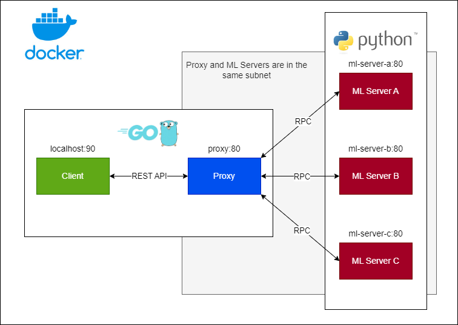

# [CSC-27 Exam] Distributed Machine Learning (ML)

## Schema

    

## Running

Firstly, execute Docker (on Windows, you must open Docker Desktop).

Then, go to project's root directory (where the `docker-compose.yml` file is) and run the following command on terminal:

- `docker compose up`

This will setup ML `servers` and a `proxy`, which will be used to call the app.

Finally, you can test the endpoints:

- (POST) `localhost:90/v1/ml-distributed/fit`

- (POST) `localhost:90/v1/ml-distributed/evaluate`

- (POST) `localhost:90/v1/ml-distributed/predict`

`fit` must be run first so `evaluate` and `predict` can work. Besides, for `predict` you must pass the features' values as parameters to the request.

## References

- In `docs` folder.
