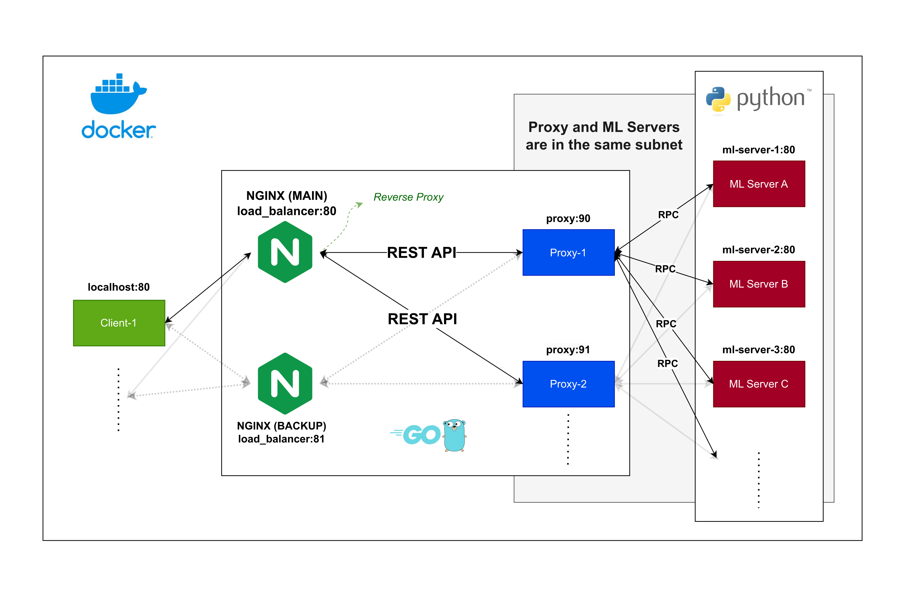

# [CSC-27 Exam] Distributed Machine Learning (ML)

## Schema

For didacts purposes, a simplified schema of the system is shown below:

    

It depicts the system's architecture, which is composed of three main components:

1. **ML Servers**: responsible for fitting, evaluating, and predicting the model. The ML servers are implemented using Python language and a RPC mechanism, which allows the proxy server to call the ML servers and execute the desired operations;
2. **Proxy Server**: responsible for receiving the requests from the client and redirecting them to the available ML servers. The proxy server is implemented in Go language and uses the RPC mechanism to call the ML servers;
3. **Client**: responsible for sending the requests to the proxy server. The client can be implemented in any language that supports HTTP requests, such as Python, Go, or Curl.

Alas, the full architecture of the system, which includes the scalability and fault tolerance mechanisms, is shown below:

    

The full architecture includes the fault tolerance, scalability and load balancing mechanisms. The fault tolerance is implemented in two separate steps, which ensures that the system is robust and resilient to failures. The scalability is implemented using the nginx load balancer, which redirects the requests to the available proxy servers. The load balancing mechanism ensures that the system can handle a large number of requests and distribute them evenly among the proxy servers. The fault tolerance and scalability mechanisms are implemented in the code and can be tested by stopping the ML servers and the proxy server.

## Running

Firstly, execute Docker (on Windows, you must open Docker Desktop).

Then, go to project's root directory (where the `docker-compose.yml` file is) and run the following command on terminal:

- `docker compose up --build`

This will setup ML `servers` and a `proxy`, which will be used to call the app.

Finally, you can test the endpoints:

- (POST) `localhost:80/v1/ml-distributed/fit`

- (POST) `localhost:80/v1/ml-distributed/evaluate`

- (POST) `localhost:80/v1/ml-distributed/predict`

`fit` must be run first so `evaluate` and `predict` can work. Besides, for `predict` you must pass the features' values as parameters to the request.

## Fault Tolerance

The fault tolerance handling is done in two separate steps with the objective of making the system robust and resilient to failures.

### Step 1: Fault Tolerance in the ML Servers

If a ML server fails, the proxy will detect, log the error, and continue without stopping the entire process. With this procedure, the system will be able to handle the failure of one or more ML servers with the consequence of having a lower number of weak learners, which could affect the model's performance. Nonetheless, the system will still be able to make predictions and evaluate the model. The error can occur in each step of the process, such as fitting, evaluating, and predicting. Here's the summary of the fault tolerance handling in the ML servers:

1. The proxy sends the request to the ML server;
2. If the ML server fails, the proxy identifies the error via the client.Call method;
3. The error is logged and informed to the user;
4. The proxy continues to the next steps, if any, without crashing or stopping the entire process.

### Step 2: Fault Tolerance in the Proxy Server

The failure of the proxy server is handled by redundancy. A load-balancing mechanism is implemented using nginx, which will redirect the requests to the available servers. If one server fails, the load balancer will redirect the requests to the other servers. The failure identification is via timeout. This ensures that, if the proxy server fails, regardless of the stage of the process (fitting, evaluating, or predicting), the system will still be able to handle the requests. Here's the summary of the fault tolerance handling in the proxy server:

1. The client sends a request to the proxy server;
2. The nginx load balancer redirects the request to the available proxy server;
3. If the proxy server is not reached within the timeout, the request is redirected to the other proxy server and the failure is logged;
4. The process is executed as expected, and the response is sent back to the client.

It is important to notice that the fault tolerance handling is done in two separate and **independent** steps, which ensures that the system is robust and resilient to failures. Both of the failure handling mechanisms are implemented in the code and can be tested by stopping the ML servers and the proxy server.

### Extra: Fault Tolerance in Nginx Load Balancer

There is a final bottleneck to be issued, which is the nginx load balancer. If the load balancer fails, the system will not be able to redirect the requests to the available proxy servers. To handle this situation, a backup and independent load balancer can be implemented. So, if the main load balancer fails, the backup load balancer will take over and redirect the requests to the available proxy servers. This is a more complex and expensive solution, but it ensures that the system will be able to handle the requests even if the main load balancer fails.

## Notes on Testing

Testing commands using `curl`:

- Fit test: `curl -X POST http://localhost:80/v1/ml-distributed/fit`

- Evaluate test: `curl -X POST http://localhost:80/v1/ml-distributed/evaluate`

- Predict test: `curl -X POST http://localhost:80/v1/ml-distributed/predict -H "Content-Type: application/json" -d @./data/house_pricing/other/one_prediction_house_pricing_test.json`

**Additionally, if the main load balancer fails, the requests should be addressed to the backup load balancer in port :81.**

## References

- In `docs` folder.
